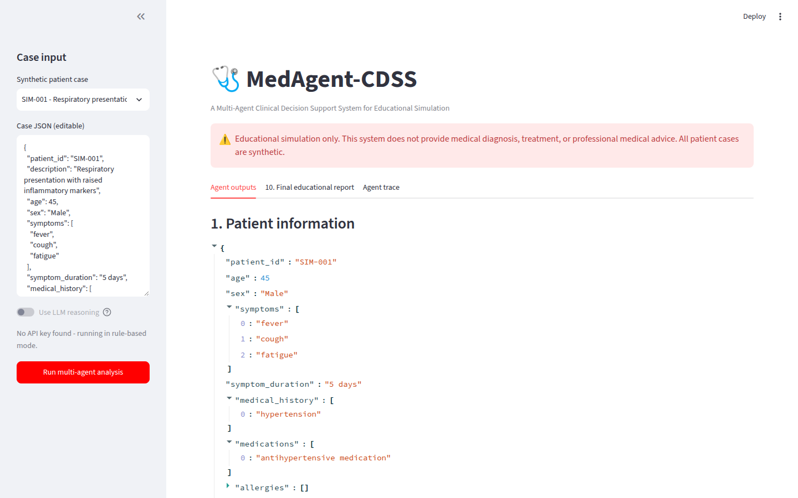
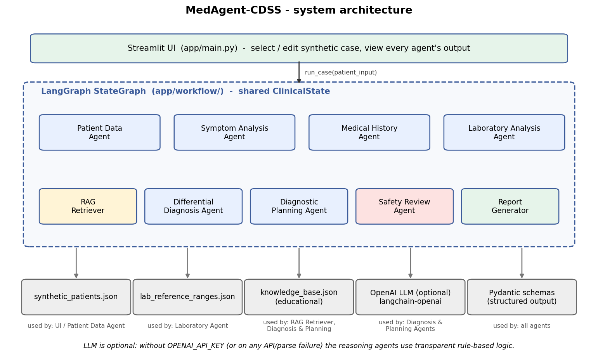
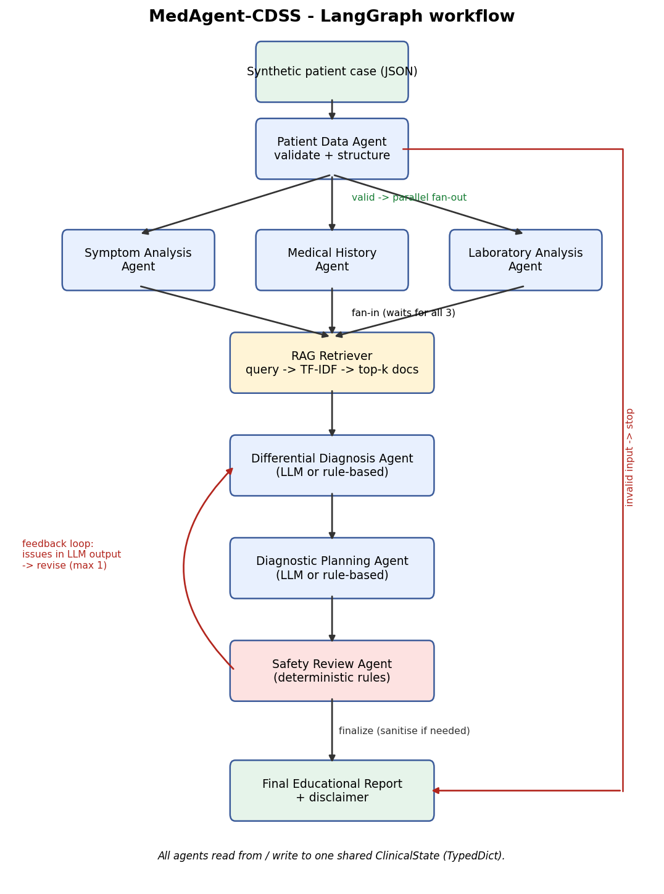

# MedAgent-CDSS

**A Multi-Agent Clinical Decision Support System for Educational Simulation**

> ⚠️ **Educational simulation only.** This system does not provide medical diagnosis, treatment, or professional medical advice. All patient data in this repository is **synthetic**. It is not a medical device and must not be used for any clinical decision.

M.Tech Computer Engineering - Agentic AI (Lab-I) project · Domain: Healthcare and Life Sciences



---

## 1. Project overview

MedAgent-CDSS is a multi-agent system, orchestrated with **LangGraph**, in which specialised agents analyse a **synthetic** patient case - symptoms, medical history and laboratory results - retrieve relevant **educational** knowledge (RAG), list conditions a student could *consider*, suggest diagnostic steps that *could be considered*, and pass everything through a **safety review** before producing an educational report.

The reasoning agents can use an LLM - the OpenAI API or a **local model such as Gemma 3 4B via Ollama** - through LangChain, with **Pydantic-structured outputs**. Without an LLM configured - or if the API fails or returns malformed output - they fall back to transparent **rule-based** logic, so the whole system can be run, tested and demonstrated offline.

## 2. Problem statement

*Clinical decision support multi-agent system:* agents analyse patient symptoms, medical history and lab reports, suggest differential diagnoses, and recommend next diagnostic steps.

## 3. Objective

- Decompose clinical case analysis into cooperating agents with clear, single responsibilities.
- Demonstrate agent-to-agent communication through a shared, typed state in LangGraph (parallel fan-out/fan-in, conditional routing and a feedback loop).
- Ground reasoning in a local, reproducible RAG knowledge base.
- Enforce safety: no certainty claims, no treatment advice, mandatory disclaimer, human-review flagging.
- Provide a testable, evaluable, GitHub-ready implementation.

## 4. Features

- 8 cooperating components (7 agents + RAG layer) plus a report generator, orchestrated by LangGraph
- Parallel execution of the Symptom, History and Laboratory agents
- Input validation that stops the workflow cleanly on invalid/missing data
- Reference-range lab comparison (sex-specific where applicable), invalid-value handling
- Local TF-IDF + lab-signal retriever over a 13-document educational knowledge base (no vector DB, no extra dependency)
- Optional LLM reasoning (OpenAI API or local Ollama model) with structured (Pydantic) outputs and automatic rule-based fallback
- Deterministic **guardrails** on every differential (grounding check, known-history cap, red-flag priority)
- Deterministic Safety Review Agent with a **feedback loop** to the Diagnosis and Planning agents and redaction of unsafe text
- Streamlit UI showing every agent's output and an agent-communication trace
- 101 automated tests (no API calls - the LLM is mocked or served by a fake local server), evaluation script + notebook, Docker support

## 5. Multi-agent architecture



## 6. Agent responsibilities

| Agent | File | Reads (from state) | Writes (to state) | Responsibility |
|---|---|---|---|---|
| Patient Data Agent | `app/agents/patient_agent.py` | `patient_input` | `patient`, `validation` | Validate with Pydantic, report missing/invalid fields, structure the case |
| Symptom Analysis Agent | `app/agents/symptom_agent.py` | `patient` | `symptom_analysis` | Key features, duration category, body systems, warning (red-flag) symptoms. No diagnosis |
| Medical History Agent | `app/agents/history_agent.py` | `patient` | `history_analysis` | Classify conditions, medication classes (context only), allergies, risk factors |
| Laboratory Analysis Agent | `app/agents/lab_agent.py` | `patient` | `lab_analysis` | Compare values with `data/lab_reference_ranges.json`: low / normal / high / invalid / unknown |
| RAG Retriever | `app/rag/` | the 3 analyses | `retrieval_query`, `retrieved_knowledge` | Build a query, retrieve top-k educational documents |
| Differential Diagnosis Agent | `app/agents/diagnosis_agent.py` | analyses, knowledge, `safety_feedback` | `differential_diagnosis` | Up to 5 conditions to *consider* with supporting and missing/conflicting evidence |
| Diagnostic Planning Agent | `app/agents/diagnostic_planning_agent.py` | analyses, differential | `diagnostic_plan` | Diagnostic steps that could be considered, each with a rationale. No treatment |
| Safety Review Agent | `app/agents/safety_agent.py` | differential, plan, red flags | `safety_review`, `safety_feedback` | Detect certainty / treatment / unsafe language / missing disclaimer; risk level; revise or redact |
| Report Generator | `app/agents/report_agent.py` | whole state | `final_report` | Educational report (JSON + Markdown) with disclaimer |

## 7. Workflow



1. **Patient Data Agent** validates the input. Invalid → jump straight to the report (workflow stopped).
2. Valid → **fan-out**: Symptom, History and Laboratory agents run **in parallel**.
3. **Fan-in**: the RAG Retriever waits for all three, builds a query (symptoms + conditions + out-of-range labs) and retrieves educational context.
4. **Differential Diagnosis Agent** reasons over the three analyses plus retrieved context.
5. **Diagnostic Planning Agent** proposes diagnostic steps for those candidates (red-flag cases always start with "prompt clinician review").
6. **Safety Review Agent** checks the output. If LLM-generated text violates a rule, it sends **feedback back to the Diagnosis Agent** (max 1 revision, configurable). Remaining violations are redacted.
7. **Report Generator** produces the final educational report.

The exact graph exported from the compiled LangGraph is in [`docs/workflow_graph.mmd`](docs/workflow_graph.mmd) (Mermaid).

## 8. Technologies used

| Technology | Used for |
|---|---|
| Python 3.10 | Implementation |
| LangGraph | `StateGraph` orchestration, parallel branches, conditional edges, feedback loop |
| LangChain (`langchain-core`, `langchain-openai`) | `ChatOpenAI`, `with_structured_output` |
| OpenAI API or Ollama (optional) | LLM reasoning for the Diagnosis and Planning agents (e.g. `gpt-4o-mini` or local `gemma3:4b`) |
| Pydantic v2 | Input validation and structured LLM output schemas |
| Streamlit | Web UI |
| python-dotenv | Loading `.env` configuration |
| pytest | Unit, integration and UI (`streamlit.testing`) tests |
| Docker | Containerised run |

## 9. Project structure

```
clinical_multi-agent_cdss/
├── app/
│   ├── main.py                 # Streamlit UI
│   ├── config.py               # settings from environment variables
│   ├── llm.py                  # ChatOpenAI factory + structured-output helper with fallback
│   ├── prompts.py              # structured prompt templates
│   ├── evaluation.py           # evaluation framework (python -m app.evaluation)
│   ├── agents/                 # patient, symptom, history, lab, diagnosis, planning, safety, report
│   ├── models/schemas.py       # PatientCase + structured output schemas
│   ├── rag/                    # knowledge_base.py, retriever.py
│   ├── utils/validators.py     # disclaimer, number checks, secret redaction
│   └── workflow/               # state.py, nodes.py, graph.py (LangGraph)
├── data/
│   ├── synthetic_patients.json # 8 synthetic cases (7 valid + 1 invalid demo)
│   ├── lab_reference_ranges.json
│   └── knowledge_base.json     # 13 educational documents
├── tests/                      # 101 tests, LLM mocked
├── evaluation/                 # safety test set + generated results
├── notebooks/evaluation.ipynb
├── docs/                       # diagrams, Mermaid graph, sample I/O, report notes
├── screenshots/                # real screenshots of the running app
├── scripts/generate_docs.py    # regenerates docs/ artefacts from the code
├── Dockerfile, .dockerignore
├── requirements.txt, requirements-dev.txt
├── .env.example, .gitignore, pytest.ini, LICENSE
└── README.md
```

## 10. Installation

```bash
git clone https://github.com/AK-Aamir-Khan/clinical_multi-agent_cdss.git
cd clinical_multi-agent_cdss
python -m venv .venv
# Windows:  .venv\Scripts\activate
# Linux/macOS: source .venv/bin/activate
pip install -r requirements.txt
```

## 11. Environment setup

```bash
# Windows: copy .env.example .env      Linux/macOS: cp .env.example .env
```

**Never commit `.env`** (it is in `.gitignore`). Choose one option:

**Option A - OpenAI API:** set `OPENAI_API_KEY` (and optionally `OPENAI_MODEL`, default `gpt-4o-mini`).

**Option B - local model with Ollama (free, offline, no API key):**

```bash
ollama pull gemma3:4b
ollama list                     # confirm the model is there; Ollama serves on port 11434
```

Then in `.env` (leave `OPENAI_API_KEY` unset or as the placeholder):

```
OPENAI_BASE_URL=http://localhost:11434/v1
OPENAI_MODEL=gemma3:4b
```

Ollama exposes an OpenAI-compatible API, so the same `ChatOpenAI` client is used - no extra dependency. Gemma 3 in Ollama does not support tool/function calling, so for a local server the app automatically uses **JSON mode** (`LLM_STRUCTURED_METHOD=json_mode`) and adds a JSON template to the prompt; the reply is still validated with Pydantic. The timeout defaults to 180 s because a 4B model on a laptop CPU can take a minute or more per agent. If the small model returns invalid JSON or the server is not running, the agent falls back to rule-based reasoning and the report says so (e.g. `Reasoning mode: rule-based fallback (gemma3:4b unavailable)`).

**Neither:** the app runs in **rule-based mode**.

Other settings: `LLM_TEMPERATURE`, `LLM_TIMEOUT_SECONDS`, `LLM_MAX_RETRIES`, `LLM_STRUCTURED_METHOD`, `USE_LLM`, `RAG_TOP_K`, `MAX_SAFETY_REVISIONS` (see `.env.example`).

## 12. How to run

```bash
streamlit run app/main.py          # web UI at http://localhost:8501
python -m pytest                   # test suite
python -m app.evaluation           # evaluation -> evaluation/results.md
python -m app.evaluation --llm     # also evaluate LLM mode (needs an API key or Ollama)
python scripts/generate_docs.py    # regenerate docs/ (PNGs need: pip install -r requirements-dev.txt)
```

Docker:

```bash
docker build -t medagent-cdss .
docker run --rm -p 8501:8501 --env-file .env medagent-cdss   # omit --env-file for rule-based mode
# with Ollama on the host, use OPENAI_BASE_URL=http://host.docker.internal:11434/v1 inside the container
```

## 13. Example synthetic input

```json
{
  "patient_id": "SIM-001",
  "age": 45,
  "sex": "Male",
  "symptoms": ["fever", "cough", "fatigue"],
  "symptom_duration": "5 days",
  "medical_history": ["hypertension"],
  "medications": ["antihypertensive medication"],
  "allergies": [],
  "lab_results": {"WBC": 13500, "CRP": 48}
}
```

## 14. Example output

Actual output for SIM-001 in rule-based mode (full JSON in [`docs/sample_output.json`](docs/sample_output.json)):

```
Conditions to consider (not a diagnosis)
- Community-acquired pneumonia (higher consideration): cough; fatigue; fever; WBC high; CRP high
- Urinary tract infection (moderate consideration): fever; WBC high; CRP high
- Influenza-like illness (moderate consideration): cough; fatigue; fever

Diagnostic steps that could be considered
- [early]   Chest X-ray is commonly used to look for lung consolidation.
- [early]   Pulse oximetry is used to assess oxygenation.
- [routine] Urinalysis (dipstick and/or microscopy) is commonly used.
- ...
Safety risk level: low (passed)
```

Agent communication trace for the same run:

| Agent | Message passed on |
|---|---|
| Patient Data Agent | Patient record valid; structured case shared with analysis agents. |
| Symptom Analysis Agent | 3 symptom(s), systems: constitutional, respiratory. |
| Medical History Agent | 1 past condition(s), 1 medication(s) and 0 allergy record(s) reviewed. |
| Laboratory Analysis Agent | 2 lab value(s) reviewed: 2 outside the reference range, 0 invalid, 0 without a reference range. |
| RAG Retriever | Retrieved 4 document(s): KB-001, KB-012, KB-005, KB-003 |
| Differential Diagnosis Agent | 3 candidate(s) via rule-based reasoning. |
| Diagnostic Planning Agent | 6 diagnostic step(s) via rule-based reasoning. |
| Safety Review Agent | Risk low; passed. |
| Report Generator | Report status: completed. |

More screenshots: [analysis](screenshots/analysis.png) · [report](screenshots/report.png) · [agent trace](screenshots/agent_trace.png) · [red-flag safety review](screenshots/safety_review.png)

### Observed behaviour with Gemma 3 4B (local, Ollama)

Measured on 2026-09-27 by sending the app's real prompts to `gemma3:4b` (Q4_K_M, temperature 0, JSON mode) on the author's laptop:

| Call | Time | JSON valid | Observation |
|---|---|---|---|
| Diagnosis, SIM-001 | 19.8 s | yes | Sensible: pneumonia (higher), influenza-like (moderate), UTI (lower, "no urinary symptoms"). Passed safety. |
| Diagnosis, SIM-005 (first prompt) | 15.2 s | yes | Ranked known diabetes *higher* and chest-pain ACS only *moderate*; listed Hypertension with no knowledge reference; supported Dengue with "chest pain". |
| Diagnosis, SIM-005 (tightened prompt) | 13.4 s | yes | ACS first; but still rated known diabetes *moderate* and invented a "location (India)" risk factor for Dengue. |
| Planning, SIM-005 | 12.7 s | yes | Good steps (ECG, troponin, ...), but "is warranted", "should be measured", "strongly support the diagnosis", and put the clinician-review label on the ECG step. |

These observations drove the deterministic guardrails in `DifferentialDiagnosisAgent.apply_guardrails` (grounding check, known-history cap, red-flag priority), the extra "necessity" safety rules and the stricter red-flag step in the planning agent. The exact replies are stored in `tests/data/gemma3_4b_recorded.json` and replayed in `tests/test_guardrails.py`, so the suite checks the system against this model's real behaviour without calling it.

## 15. Testing

```bash
python -m pytest
```

101 tests cover: `PatientCase` validation, every agent, RAG retrieval, diagnosis/planning output structure, safety detection and redaction, the full LangGraph workflow on every synthetic case, the safety feedback loop, LLM API failure and malformed-output fallback, the local-model path (a fake OpenAI-compatible server on localhost checks the real client, JSON mode and parsing), secret redaction in errors, and headless Streamlit UI tests. **No test calls the OpenAI API or needs Ollama** - LLM behaviour is simulated with a fake model (`tests/fakes.py`) or a fake local server (`tests/test_local_llm_server.py`).

### Evaluation

`python -m app.evaluation` measures input-validation accuracy, workflow completion rate, agent execution success rate, structured-output validity, disclaimer presence, safety-rule detection / false-positive rate (on a small hand-written labelled set) and latency. Results are written to [`evaluation/results.md`](evaluation/results.md).

These numbers describe **software behaviour on synthetic data** that was written alongside the rules, so high scores show the pipeline works as designed - they are **not** evidence of clinical accuracy or generalisation. LLM-mode metrics are only produced when an LLM (API key or Ollama) is configured.

## 16. Safety and ethical limitations

- Educational simulation only; not validated clinically; not a medical device.
- Synthetic data only - never enter real patient information.
- The knowledge base is a short set of general summaries written for this project, not an authoritative clinical source.
- Reference ranges are approximate; real ranges vary by laboratory, method and population.
- Consideration levels are relative labels, not probabilities.
- The safety agent is rule-based: it can miss paraphrased unsafe text and may over-flag. Outputs flagged as high risk are marked for human review.
- LLM output can be wrong or inconsistent even after structuring and safety review.

## 17. Future enhancements

- Embedding-based retrieval (e.g. FAISS) once the knowledge base grows beyond keyword-friendly size
- An LLM-based safety critic *in addition to* the deterministic rules
- Larger, clinician-reviewed synthetic case set with expected outputs for evaluation
- LangGraph checkpointing for human-in-the-loop review of high-risk cases
- Tracing/observability (e.g. LangSmith) for LLM-mode runs

## 18. GitHub usage

```bash
git init
git add .
git status                      # confirm .env and .venv are NOT listed
git commit -m "MedAgent-CDSS: educational multi-agent CDSS"
git branch -M main
git remote add origin https://github.com/AK-Aamir-Khan/clinical_multi-agent_cdss.git
git push -u origin main
```

Before pushing, check that no API key appears anywhere: `git grep -n "sk-"` should only show the deliberately fake keys in `tests/test_diagnosis_agent.py` and `tests/test_workflow_state.py` (used to test that secrets are redacted from error messages).

## 19. License

MIT - see [LICENSE](LICENSE). Educational use only.
