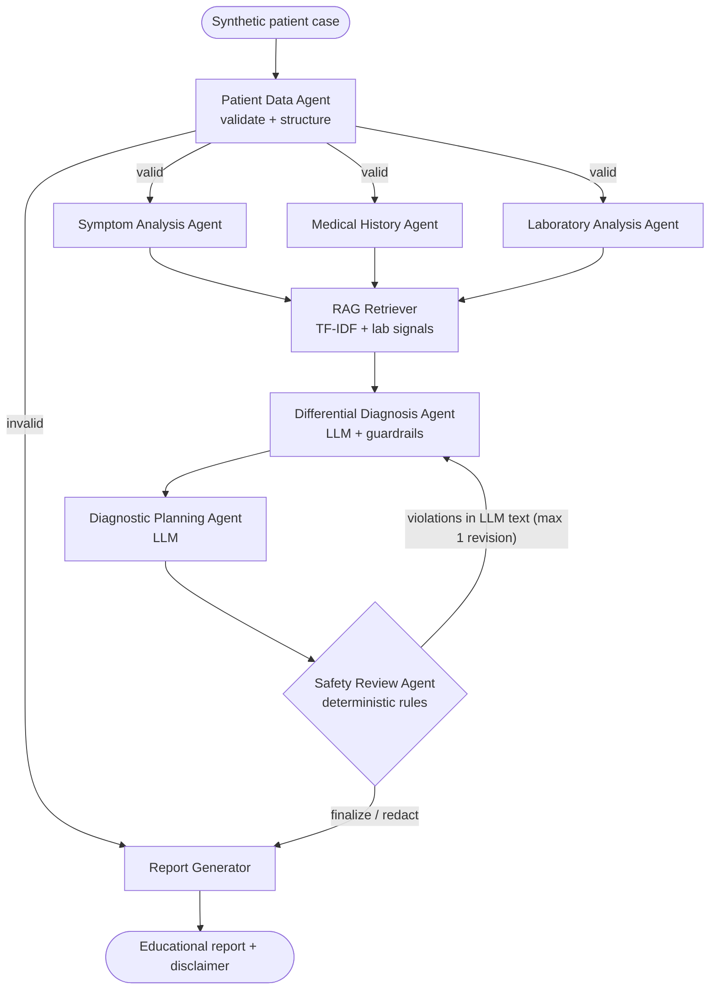
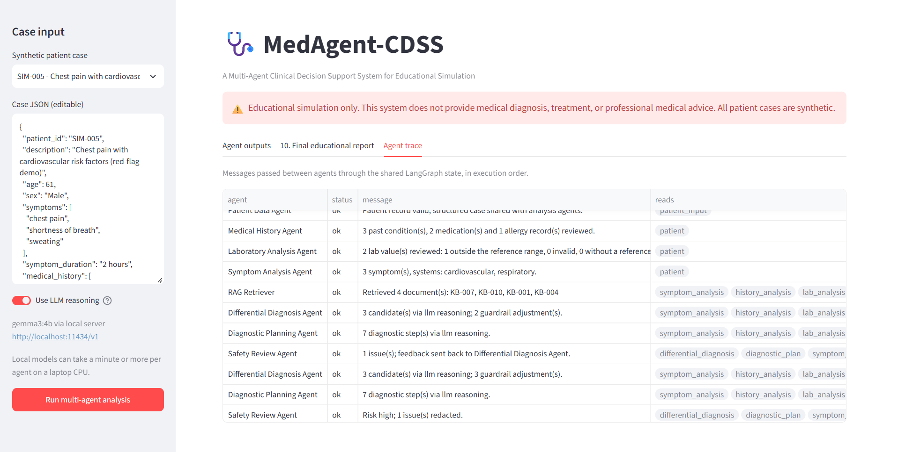
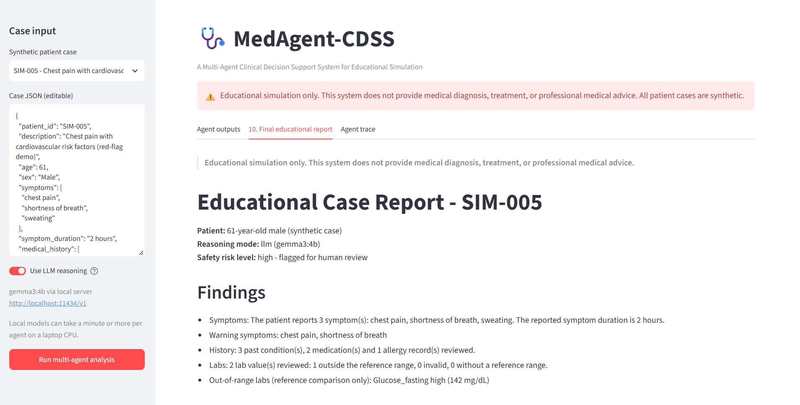
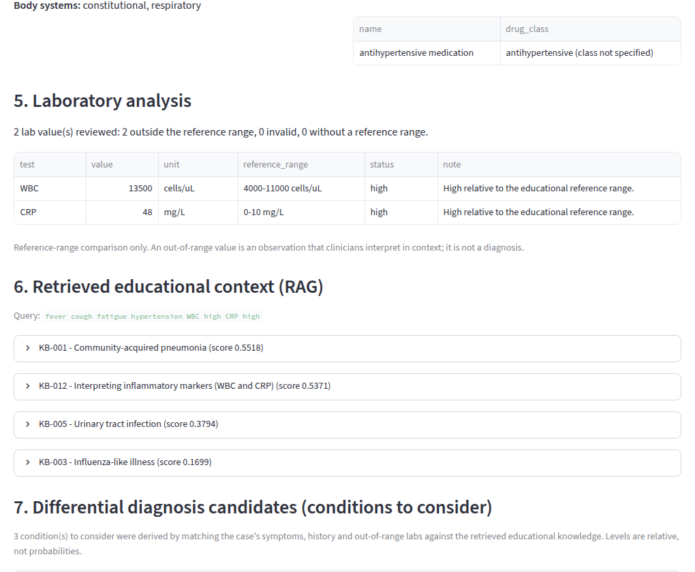
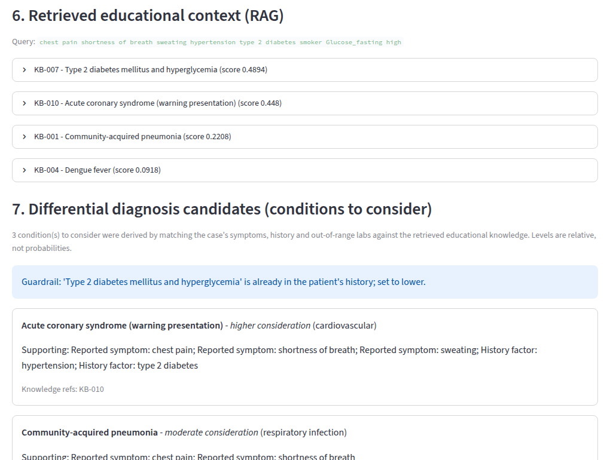
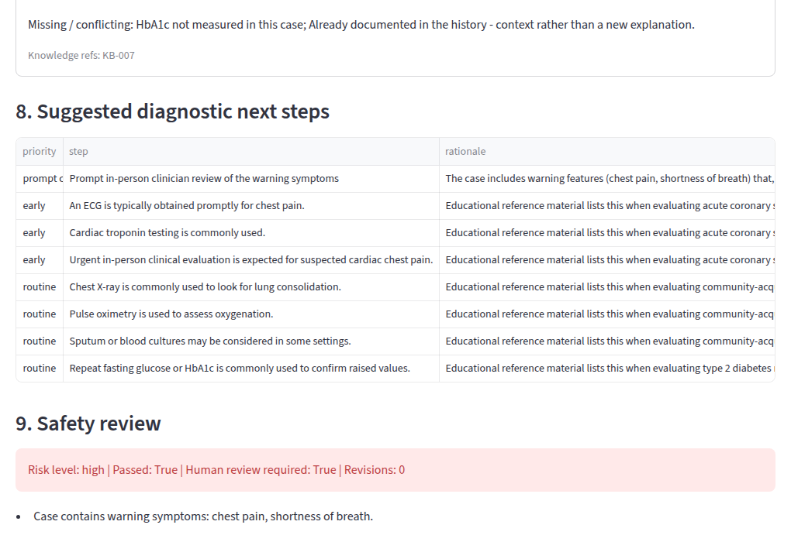
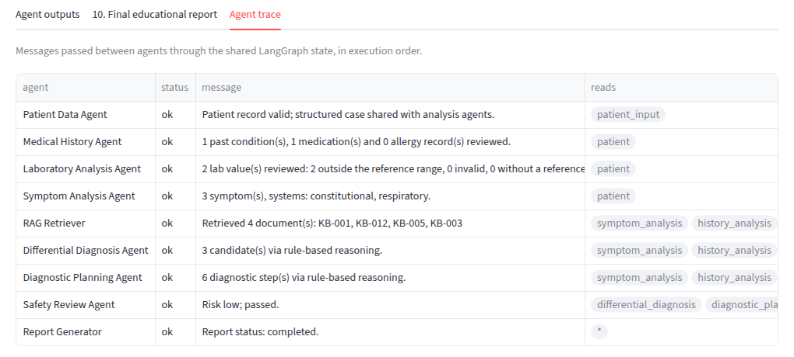
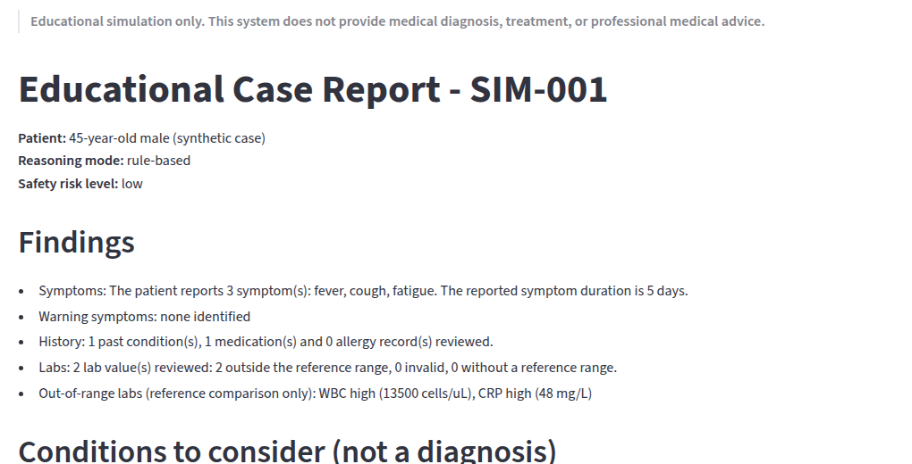
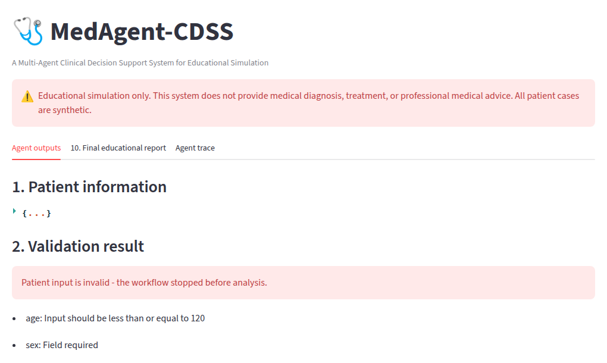

# 🩺 MedAgent-CDSS

**A Multi-Agent Clinical Decision Support System for Educational Simulation**


> [!WARNING]
> **Educational simulation only.** This system does not provide medical diagnosis, treatment, or professional medical advice. All patient data in this repository is **synthetic**. It is not a medical device and must not be used for any clinical decision.

MedAgent-CDSS is a **LangGraph** multi-agent system. Specialised agents analyse a synthetic patient case (symptoms, medical history and lab results), retrieve educational knowledge (**RAG**), list conditions a student could *consider*, and suggest diagnostic steps that *could be considered*. Everything passes through **deterministic guardrails** and a **safety review** before the report is produced. Reasoning runs on a **local LLM (Gemma 3 4B via Ollama)** or the OpenAI API. With neither configured, a transparent rule-based mode keeps the whole system runnable offline.

*M.Tech Computer Engineering · CE509 Agentic AI (Computer DLOC Lab-I) · Domain: Healthcare and Life Sciences*


---

## Contents

- [Highlights](#highlights)
- [Quick start](#quick-start)
- [How it works](#how-it-works)
- [Agents](#agents)
- [Running with Gemma 3 4B (Ollama)](#running-with-gemma-3-4b-ollama)
- [Screenshots](#screenshots)
- [Example input and output](#example-input-and-output)
- [Testing and evaluation](#testing-and-evaluation)
- [Project structure](#project-structure)
- [Configuration](#configuration)
- [Docker](#docker)
- [Safety and limitations](#safety-and-limitations)
- [Future work](#future-work)
- [Documentation](#documentation)
- [Author](#author) · [License](#license)

---

## Highlights

- **Real multi-agent orchestration:** LangGraph `StateGraph` with a shared typed state, a **parallel fan-out/fan-in** of three analysis agents, **conditional routing** and a **safety feedback loop**.
- **Local LLM, no API key:** Gemma 3 4B through Ollama's OpenAI-compatible API. JSON mode with **Pydantic-validated** structured outputs.
- **Grounded reasoning:** a reproducible TF-IDF + lab-signal retriever over a 13-document educational knowledge base. No vector DB, no extra dependency.
- **Guardrails in code, not just in prompts:**
  - **Grounding check:** an LLM candidate must cite retrieved knowledge that matches a reported symptom or abnormal lab.
  - **Known-history cap:** conditions already in the patient's history are capped at "lower".
  - **Red-flag priority:** the condition that best explains warning symptoms is listed first.
- **Deterministic Safety Review Agent:** detects certainty claims, treatment advice, unsafe or "necessity" wording and missing disclaimers. It assigns a risk level, flags cases for human review, sends feedback for one revision, then redacts.
- **Robust by design:** invalid input stops cleanly. LLM timeouts, connection errors or malformed JSON fall back to rule-based reasoning, and the report says so. Secrets are redacted from errors.
- **Tested against real model behaviour:** 101 tests, including **recorded Gemma 3 4B replies** replayed as regression fixtures. No test needs the internet or a running model.

---

## Quick start

**Prerequisites:** Python 3.10+, and optionally [Ollama](https://ollama.com) for LLM mode.

```bash
git clone https://github.com/AK-Aamir-Khan/Clinical-Decision-Support-Multi-Agent-System.git
cd Clinical-Decision-Support-Multi-Agent-System

python -m venv .venv
# Windows:      .venv\Scripts\activate
# Linux/macOS:  source .venv/bin/activate
pip install -r requirements.txt

# Optional, LLM mode with a local model:
ollama pull gemma3:4b
copy .env.example .env        # Linux/macOS: cp .env.example .env
# then in .env set:
#   OPENAI_BASE_URL=http://localhost:11434/v1
#   OPENAI_MODEL=gemma3:4b

streamlit run app/main.py     # opens http://localhost:8501
```

Without `.env`, the app runs in **rule-based mode**: every agent still works and no model is needed.

| Command | What it does |
|---|---|
| `streamlit run app/main.py` | Web UI: pick a synthetic case, run the agents, inspect every output |
| `python -m pytest` | Run the 101 tests (no API calls) |
| `python -m app.evaluation` | Metrics on all synthetic cases → `evaluation/results.md` |
| `python -m app.evaluation --llm` | Also evaluate LLM mode (needs Ollama or an API key) |
| `python scripts/generate_docs.py` | Regenerate diagrams and sample output in `docs/` |

---

## How it works



1. The **Patient Data Agent** validates the input with Pydantic. Invalid input goes straight to the report.
2. The **Symptom, History and Laboratory** agents run **in parallel**.
3. The **RAG Retriever** waits for all three (fan-in). It builds a query from symptoms, conditions and out-of-range labs, and retrieves educational documents.
4. The **Differential Diagnosis Agent** reasons over the analyses and the retrieved context. **Guardrails** then check and correct the result.
5. The **Diagnostic Planning Agent** proposes diagnostic steps. Red-flag cases always start with "prompt clinician review".
6. The **Safety Review Agent** checks the text. If LLM output breaks a rule, it sends **feedback** to the Diagnosis and Planning agents for one revision. Any remaining violations are redacted.
7. The **Report Generator** assembles the final educational report.

Agents never call each other directly. They communicate only through the shared `ClinicalState`, and every step is logged in an **agent-communication trace** shown in the UI.

<details>
<summary>Architecture diagram</summary>


</details>

---

## Agents

| Agent | File | Reads | Writes | Type |
|---|---|---|---|---|
| Patient Data Agent | `app/agents/patient_agent.py` | `patient_input` | `patient`, `validation` | Rules |
| Symptom Analysis Agent | `app/agents/symptom_agent.py` | `patient` | `symptom_analysis` | Rules |
| Medical History Agent | `app/agents/history_agent.py` | `patient` | `history_analysis` | Rules |
| Laboratory Analysis Agent | `app/agents/lab_agent.py` | `patient` | `lab_analysis` | Rules |
| RAG Retriever | `app/rag/` | the three analyses | `retrieved_knowledge` | Rules |
| Differential Diagnosis Agent | `app/agents/diagnosis_agent.py` | analyses, knowledge, `safety_feedback` | `differential_diagnosis` | LLM + guardrails |
| Diagnostic Planning Agent | `app/agents/diagnostic_planning_agent.py` | analyses, differential, `safety_feedback` | `diagnostic_plan` | LLM + rules |
| Safety Review Agent | `app/agents/safety_agent.py` | differential, plan, red flags | `safety_review`, `safety_feedback` | Rules |
| Report Generator | `app/agents/report_agent.py` | whole state | `final_report` | Rules |

**Design principle:** the LLM is used only where language reasoning adds value. Validation, ranking constraints and safety stay in deterministic, testable code.

---

## Running with Gemma 3 4B (Ollama)

Gemma 3 in Ollama does not support tool/function calling. When `OPENAI_BASE_URL` points to a local server, the app therefore switches automatically to **JSON mode**. It adds a JSON template generated from the Pydantic schema to the prompt and validates the reply. The default timeout is 180 s, and the sidebar shows `gemma3:4b via local server …`.

**Observed behaviour:** these replies were measured by sending the agents' real prompts to `gemma3:4b` (Q4_K_M, temperature 0) on a laptop CPU.

| Call | Time | Valid JSON | Observation |
|---|---|---|---|
| Diagnosis, SIM-001 | 19.8 s | ✅ | Sensible ranking; passed safety review |
| Diagnosis, SIM-005 (first prompt) | 15.2 s | ✅ | Ranked known diabetes above chest-pain ACS; ungrounded "Hypertension" and "Dengue" candidates |
| Diagnosis, SIM-005 (tightened prompt) | 13.4 s | ✅ | ACS first, but **invented a patient location** as evidence for dengue |
| Planning, SIM-005 | 12.7 s | ✅ | Good steps (ECG, troponin) but "is warranted" / "should be measured" |

**Lesson:** a 4B model handles structure and explanation well, but prompt fixes alone did not stop the invented evidence. The **guardrails** and the **safety agent** catch every issue above. The exact replies are stored in [`tests/data/gemma3_4b_recorded.json`](tests/data/gemma3_4b_recorded.json) and replayed in [`tests/test_guardrails.py`](tests/test_guardrails.py).

A full case takes about 30–40 s with Gemma on a CPU, and about twice that when the safety agent requests a revision.

**Live run in the UI with Gemma 3 4B (SIM-005, red-flag case).** The trace shows LLM reasoning, guardrail adjustments, the Safety Review Agent sending feedback, one revision by the Diagnosis and Planning agents, and final redaction. The report confirms `Reasoning mode: llm (gemma3:4b)`.

| | |
|---|---|
|  |  |
| **Agent trace:** guardrails, safety feedback loop, revision, redaction | **Final report:** `Reasoning mode: llm (gemma3:4b)`, high risk flagged for human review |

---

## Screenshots

> Captured from the running app with the latest code, in rule-based mode. For LLM-mode screenshots with Gemma 3 4B, see [Running with Gemma 3 4B](#running-with-gemma-3-4b-ollama).

| | |
|---|---|
|  |  |
| **RAG context and conditions to consider** (SIM-001) | **Red-flag case:** guardrail note, ACS listed first (SIM-005) |
|  |  |
| **Clinician review first; high risk, human review** (SIM-005) | **Agent-communication trace** (SIM-001) |
|  |  |
| **Final educational report** (SIM-001) | **Invalid input stops the workflow** (SIM-008) |

---

## Example input and output

**Input** (synthetic case SIM-001):

```json
{
  "patient_id": "SIM-001",
  "age": 45,
  "sex": "Male",
  "symptoms": ["fever", "cough", "fatigue"],
  "symptom_duration": "5 days",
  "medical_history": ["hypertension"],
  "medications": ["antihypertensive medication"],
  "allergies": [],
  "lab_results": {"WBC": 13500, "CRP": 48}
}
```

**Output** (rule-based mode; full JSON in [`docs/sample_output.json`](docs/sample_output.json)):

```text
Conditions to consider (not a diagnosis)
- Community-acquired pneumonia (higher):   cough; fatigue; fever; WBC high; CRP high
- Urinary tract infection (moderate):      fever; WBC high; CRP high
- Influenza-like illness (moderate):       cough; fatigue; fever

Diagnostic steps that could be considered
- [early]   Chest X-ray is commonly used to look for lung consolidation.
- [early]   Pulse oximetry is used to assess oxygenation.
- [routine] Urinalysis (dipstick and/or microscopy) is commonly used.
- ...
Safety risk level: low (passed)
```

**Synthetic demo cases** in [`data/synthetic_patients.json`](data/synthetic_patients.json):

| Case | Demonstrates |
|---|---|
| SIM-001 | Respiratory presentation with raised inflammatory markers |
| SIM-002 | Fatigue and pallor with low hemoglobin indices |
| SIM-003 | Thirst and frequent urination with raised glucose |
| SIM-004 | Acute fever with rash and low platelets |
| SIM-005 | Chest pain with risk factors: **red flags, high risk, guardrails** |
| SIM-006 | Tiredness and cold intolerance with raised TSH |
| SIM-007 | One **invalid lab value**: excluded and flagged |
| SIM-008 | **Invalid record**: workflow stops at validation |

---

## Testing and evaluation

```bash
python -m pytest            # 101 passed
python -m app.evaluation    # writes evaluation/results.md
```

The tests cover every agent, RAG retrieval, output structure and safety rules. They also run the full workflow on every case and exercise the feedback loop, LLM failure and malformed-output fallback, and the local-server path (a fake OpenAI-compatible server on localhost). Finally, they replay the recorded Gemma replies and run headless Streamlit UI tests.

| Metric (rule-based mode) | Result |
|---|---|
| Input validation accuracy | 100% (15/15) |
| Workflow completion rate | 100% (7/7) |
| Agent execution success rate | 100% (65/65) |
| Structured output validity | 100% (14/14) |
| Disclaimer present in report | 100% (8/8) |
| Safety violation detection / false positives | 100% (18/18) / 0% (0/12) |
| Latency per case (mean / max) | 7.4 ms / 11.9 ms |

> These numbers describe **software behaviour on synthetic data** written alongside the rules. They show that the pipeline works as designed; they are **not** evidence of clinical accuracy.

---

## Project structure

```
Clinical-Decision-Support-Multi-Agent-System/
├── app/
│   ├── main.py                  # Streamlit UI
│   ├── config.py                # settings from environment variables
│   ├── llm.py                   # LLM factory, JSON-mode template, structured call with fallback
│   ├── prompts.py               # structured prompt templates
│   ├── evaluation.py            # evaluation framework
│   ├── agents/                  # patient, symptom, history, lab, diagnosis, planning, safety, report
│   ├── models/schemas.py        # PatientCase + output schemas
│   ├── rag/                     # knowledge_base.py, retriever.py
│   ├── utils/validators.py      # disclaimer, number checks, secret redaction
│   └── workflow/                # state.py, nodes.py, graph.py (LangGraph)
├── data/                        # synthetic cases, reference ranges, educational knowledge base
├── tests/                       # 101 tests + recorded Gemma replies (tests/data/)
├── evaluation/                  # safety test set and results
├── notebooks/evaluation.ipynb
├── docs/                        # diagrams, Mermaid graph, sample I/O, report notes
├── screenshots/                 # screenshots of the running app
├── scripts/generate_docs.py     # regenerates docs/ from the code
├── Dockerfile, requirements.txt, requirements-dev.txt
└── .env.example, pytest.ini, LICENSE
```

---

## Configuration

All settings come from environment variables (`.env`, see [`.env.example`](.env.example)). **Never commit `.env`**; it is already in `.gitignore`.

| Variable | Default | Purpose |
|---|---|---|
| `OPENAI_BASE_URL` | – | Local OpenAI-compatible server, e.g. `http://localhost:11434/v1` for Ollama |
| `OPENAI_MODEL` | `gpt-4o-mini` | Model name, e.g. `gemma3:4b` |
| `OPENAI_API_KEY` | – | Only needed for the OpenAI API |
| `LLM_STRUCTURED_METHOD` | auto | `json_mode` for local servers, `function_calling` for OpenAI |
| `LLM_TIMEOUT_SECONDS` | 180 local / 30 API | Request timeout |
| `USE_LLM` | `true` | `false` forces rule-based mode |
| `RAG_TOP_K` | `4` | Number of knowledge documents retrieved |
| `MAX_SAFETY_REVISIONS` | `1` | Safety feedback loop limit |

---

## Docker

```bash
docker build -t medagent-cdss .
docker run --rm -p 8501:8501 medagent-cdss                    # rule-based mode
docker run --rm -p 8501:8501 --env-file .env medagent-cdss    # with your settings
```

To reach Ollama on the host from inside the container, use `OPENAI_BASE_URL=http://host.docker.internal:11434/v1`.

---

## Safety and limitations

- Educational simulation only. It is not clinically validated and not a medical device. **Never enter real patient data.**
- The knowledge base contains short general summaries written for this project. It is not an authoritative clinical source.
- Reference ranges are approximate; real ranges vary by laboratory, method and population.
- Consideration levels ("higher / moderate / lower") are relative labels, not probabilities.
- The safety agent is rule-based. It can miss paraphrased unsafe text and may over-flag. High-risk cases are marked for human review.
- Small local models can be wrong or inconsistent even after structuring, guardrails and safety review.

## Future work

- Embedding-based retrieval (e.g. FAISS) for a larger knowledge base
- An LLM-based safety critic **in addition to** the deterministic rules
- A clinician-reviewed synthetic case set with expected outputs
- LangGraph checkpointing for human-in-the-loop review of high-risk cases
- Tracing and observability for LLM-mode runs

## Documentation

- [`docs/PROJECT_REPORT.md`](docs/PROJECT_REPORT.md): design notes, communication design and viva Q&A
- [`docs/workflow_graph.mmd`](docs/workflow_graph.mmd): graph exported from the compiled LangGraph
- [`evaluation/results.md`](evaluation/results.md): latest evaluation results
- [`notebooks/evaluation.ipynb`](notebooks/evaluation.ipynb): evaluation notebook

## Author

**Aamir Khan**, M.Tech Computer Engineering
[GitHub](https://github.com/AK-Aamir-Khan) · [LinkedIn](https://www.linkedin.com/in/akhanengineer)

## License

[MIT](LICENSE). For educational use only.
